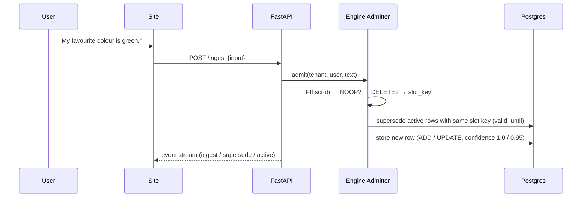
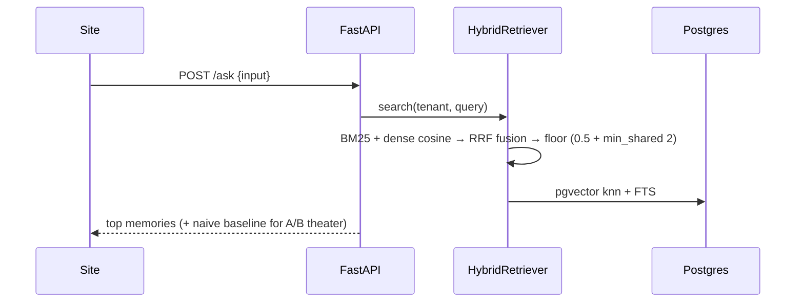
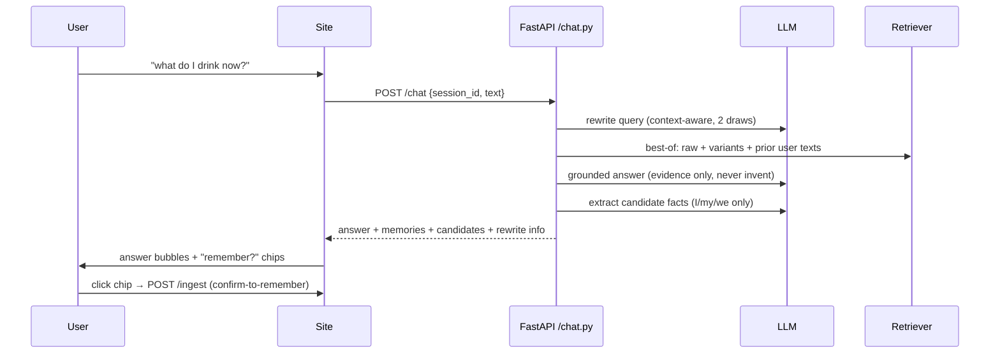

# Architecture

> What every part of this project is, why it exists, and how it works. Product-level view across both repositories:
> - **MemoryOS-Application** (this repo) — site + API + docs
> - **MemoryOS** — the engine library (separate public repo, `Abhii-07/MemoryOS`)

---

## 1. Overview

MemoryOS is an AI-memory engine plus a premium product website around it. The engine stores what a user says, understands when preferences change, and retrieves the *current* truth — not stale statements — so an AI chatbot built on it answers from an auditable, contradiction-free memory.

The product ships in three parts:

| Part | What it is | Why it exists |
| --- | --- | --- |
| **Engine** (`memory_os` Python lib) | Deterministic admission + hybrid retrieval + lifecycle over Postgres | The core: decides what to store, when to supersede, what to retrieve. No LLM in the loop — guarantees 0% contradiction (acceptance-measured). |
| **FastAPI server** (`server/`) | HTTP wrapper + LLM layer (chat, assistant, providers) | The engine is a library; the web needs an API. Also the place where LLM judgment is *allowed* (rewrites, grounded answers, fact extraction) — never in admission. |
| **Next.js site** (`site/`) | Marketing landing page + live playground | Present the product; prove it works against the real engine. |

```
┌────────────┐      ┌──────────────┐      ┌────────────────┐      ┌──────────────────┐
│  Next.js   │HTTP  │   FastAPI    │      │  engine lib    │ SQL  │ PostgreSQL 17    │
│  site :3000│ ───► │  server :8000│ ───► │ (memory_os)    │ ───► │ + pgvector :5433 │
└────────────┘      └──────┬───────┘      └────────────────┘      └──────────────────┘
                           │ HTTP
                           ▼
                    ┌──────────────┐
                    │  Ollama /    │   LLM for chat & assist (never admission)
                    │  cloud LLM   │
                    └──────────────┘
```

## 2. Data flows

### Ingest (Message panel / chat "remember")


### Ask (Ask panel, A/B)


### Chat (Chat panel) — the assistant loop


### Assist (single-shot grounded Q&A)
`POST /assist` = retrieval + evidence JSON → provider LLM → never-invent answer. No session state.

---

## 3. Database — PostgreSQL 17 + pgvector

**What:** persistent store. Portable install at `C:\pg17\` (Windows), DB `memoryos`, role `memoryos` (trust), port **5433** (`postgresql.conf`), pgvector 0.8.6.

**Why PostgreSQL + pgvector:** relational facts (tenant isolation, validity windows, audit) AND dense vectors (semantic retrieval) in one DB — no dual stores. ADR-003.

**How — the `memories` table** (`schema.sql`, applied on server startup):

| Column | Purpose |
| --- | --- |
| `id` (uuid) | stable record identity |
| `tenant_id` / `user_id` | isolation; every op scoped by tenant (ADR-008) |
| `text` | the stored fact (PII-scrubbed, never raw secrets) |
| `admission_op` | ADD / UPDATE / DELETE / NOOP — the write decision, recorded |
| `status` | active / superseded (validity window) |
| `valid_from` / `valid_until` | **supersession window** (ADR-002): UPDATE closes the old row's `valid_until`, new row becomes current |
| `confidence` | 1.0 on ADD; 0.95 on UPDATE — low-confidence supersession keeps both rows retrievable (false-positive safety, ADR-002) |
| `dense_embedding` (vector 384) | all-MiniLM-L6-v2 embedding for semantic retrieval |
| `sparse_terms` | BM25-able term frequencies for lexical retrieval |
| `provenance` | user_stated / assistant_generated — where the fact came from |
| `pii_scan_result` + detector version | redaction audit |
| `importance_score` | set at admission; drives decay eligibility |
| `created_at` / `updated_at` | timeline |

Supersession is the heart: **same slot key + active prior row → close old window, store new row.** Old facts stay queryable via audit but never win retrieval against the current one.

**Windows quirk:** `pg_ctl`/service spawns crash with `0xC0000142` (STATUS_DLL_INIT_FAILED — postmaster's restricted child spawn). Console-attached `postgres.exe -D C:\pg17\data` works and is the documented run mode (`docs/PHASE5-POSTGRES-ISSUE.md`).

---

## 4. Engine — the `memory_os` library

Engine repo: `D:\Abhii\Projects\MemoryOS` → `implementation\MemoryOS-App\src\memory_os`. Pure Python, no web framework; the server imports it directly.

### Modules

| Module | What / how | Why |
| --- | --- | --- |
| `admission/` | Deterministic grammar (`patterns.py`, ADR-008): PII pre-scrub → NOOP (filler) → DELETE directive (consent purge) → slot-key supersession → ADD. No LLM, no network; same input → same verdict | **0% contradiction guarantee.** LLM judgment at write time was rejected (week-1 matrix; LLM-judged freshness performs worse than deterministic slots). Grammar is the entire decision surface, frozen with tests. |
| `admission/slot grammar` | Regex rules map text → slot key: `favorite <color|drink|…>`, `like/prefer <object>`, tool/project/event patterns | Same real-world slot must collide for supersession; unrelated facts must not (collision policy) |
| `retrieval/` | `HybridRetriever`: BM25 + dense cosine → RRF fusion → two-signal floor (`cosine ≥ 0.5` AND `≥ 2 shared tokens`) → `NoRelevantMemory` when nothing clears | Semantic recall + lexical precision; the floor stops low-value noise (EC-13); "no memory" is an explicit outcome, never a wrong guess |
| `embeddings/` | `sentence-transformers/all-MiniLM-L6-v2` (384-d), lazy-loaded once per process | Local, no API cost, fast (p95 12 ms measured) |
| `db/store.py` | `add`, `supersede` (validity window), `get_active`, `delete`; transactional | Write-path mechanics over the schema |
| `lifecycle/` | Importance at admission, decay eligibility | Old/low-value memories retire; no unbounded growth |
| `audit/` | Lineage trail per memory (CREATED → SUPERSEDED → ACTIVE, DELETE) | "The AI you can audit" — every decision replayable |
| `observability/` | Typed spans (admission, retrieval, ranking, supersession); collector redacts PII from events | Traceability without leaking secrets (invariant #5) |
| `context/` | Per-zone token-budgeted memory injection (G-M3): memories injected only into `retrieved_memory` zone until its ceiling; nothing overflows (EC-010) | LLM context stays within budget; the correct fact survives |

### Acceptance evidence (`bench/acceptance.py`)
precision@1 **1.0** · contradiction **0.0** (baseline 0.333) · cold-start FP **0.0** (0.5) · sensitive leak **0.0** · p95 **12 ms** (< 150 ms target) · 97 tests.

### Deliberate limits
- Admission understands **slot-level** changes ("I prefer coffee" → "I switched to tea" = same slot → supersede). Subtle hints ("mangos are growing on me") are beyond the deterministic grammar by design — handled at the chat layer instead (see §5).
- Spelling variants must match the grammar (`favorite`/`color`; British `favourite`/`colour` currently map to no slot → no supersession). Fixing this is a grammar + test change in `patterns.py` (ADR-008 extension).

---

## 5. Server — FastAPI wrapper + LLM layer

**Why an API:** the engine is a library; the web app needs HTTP. **Why an LLM layer here:** this is where LLM judgment is safe — decisions are *suggestions* the user confirms; the deterministic engine executes them. `server/` is ~6 files + `providers/`.

### Endpoints

| Endpoint | What | Notes |
| --- | --- | --- |
| `POST /ingest` | admit a turn → event stream (ADD/UPDATE/DELETE/NOOP) | raw engine write path, deterministic |
| `POST /ask` | hybrid retrieval + naive baseline | A/B theater data |
| `POST /chat` | conversational loop (see below) | sessions in-process: 64 max, 12 turns, last 6 in context |
| `POST /assist` | single-shot grounded Q&A | never-invent system prompt; 502 on provider error |
| `GET /assist/providers` | configured providers + active | honest gating |
| `GET /memory` · `GET /audit` | memories + per-memory trail | playground ledger |
| `GET /healthz` | readiness | `run.ps1` polls it — no guess-timing |

### `chat.py` — the assistant loop
1. **Query rewrite (S-015):** LLM rewrites the user's question into 2 keyword-rich phrase variants, borrowing nouns from recent conversation. Double-draw (2 attempts unioned) so one bad model output can't kill retrieval; lenient JSON parse (falls back to quoted-token regex).
2. **Best-of retrieval:** raw query + variants + the session's prior user texts (natural phrasing clears the 0.5 floor far more reliably than single keywords). Highest score wins; floor still applies.
3. **Grounded answer:** LLM answers from evidence JSON only; "never invent" is enforced in the system prompt. The assistant's own previous reply is excluded from the transcript so the model can't imitate a prior "no evidence" line while evidence exists.
4. **Fact extraction (S-014):** a second LLM call pulls candidate facts (I/my/we statements; questions → `[]`). The UI shows them as **"remember?" chips** — nothing is written without the user confirming (confirm-to-remember).

### Providers (`server/providers/`)
`base.py` (Provider ABC + `with_fallback` probe) · `ollama.py` (local, key-less) · `openrouter.py` / `openai.py` / `anthropic.py` (hosted) · `registry.py` (auto-pick first configured; `MEMORYOS_ASSIST_PROVIDER` forces one). **Honest `is_configured`:** cloud = key present; Ollama = endpoint up **and** model present in `/api/tags` (prevents a "configured but unusable" lie). Keys live only in `server/.env` (gitignored; `.env.example` is the committed template).

### Config & lifecycle
- `MEMORYOS_DB_DSN` (default `postgresql://memoryos@localhost:5433/memoryos`), provider env vars.
- `run.ps1 -Start/-Restart/-Status/-Logs`: readiness = `/healthz` poll; per-run logs `uvicorn.<stamp>.log/.err.log` (no shared-file lock); lazy embedder → ~1 s boot. PG reachability is pre-checked (warns, doesn't fail).
- Engine schema applied at startup (retried on first ingest if PG is down).

---

## 6. Site — Next.js (landing + playground)

**Why Next.js:** static-first, fast, zero-config deploys; the landing page must never depend on the backend (S-001).

### Engine abstraction (`site/lib/engine/`)
`MemoryEngine` interface (`ingest` · `ask` · `chat` · `assist` · `getMemories` · `audit`) with two implementations:
- `DemoMemoryEngine` — deterministic seeded dataset; powers the **landing page only** (S-001: marketing never needs a backend)
- `ApiMemoryEngine` — real HTTP calls to the FastAPI server; hard-wired in the **playground** (S-006); base URL from `NEXT_PUBLIC_MEMORY_API_URL` (default `http://127.0.0.1:8000`)

### Pages & components
| Part | Components | Role |
| --- | --- | --- |
| `/` landing | Hero (`MemoryCore` canvas + coffee→tea narrative), 7-act story (`MemoryConversation`, `MemoryGraph`, `DecisionStream`, `DeveloperSection`, `TrustSection`, `UseCases`), final CTA, footer | Present memory as a product: "AI that remembers, audits, supersedes" |
| `/playground` | `LivePlayground` with 4 panels: **Message** (ingest event stream), **Ask** (A/B naive vs MemoryOS), **Chat** (`ChatPanel`: turn bubbles, evidence list, rewritten-query hint, remember chips, reset), **Memories** (ledger + per-memory audit) | Live proof against the real engine |

### Hard constraints (spec §34–59, verified Phase 4)
Canvas 2D/SVG only (no WebGL/Three.js/GSAP) · transform/opacity animation, rAF, DPR ≤ 2 · node caps · IntersectionObserver + tab-visibility pauses · `prefers-reduced-motion` + manual toggle · `:focus-visible` rings, keyboard nav, ARIA · real metrics only (11 ms · 0% · 97 tests) · measured: Lighthouse mobile 96/100/100/100, desktop 100/100/100/100, CLS 0, LCP 94 ms.

---

## 7. Design decisions (why each part is shaped this way)

| # | Decision | Why |
| --- | --- | --- |
| ADR-002 | Deterministic `valid_until` supersession, low-confidence fallback keeps both rows | Baselines showed similarity-only ranking loses the current truth 33% of the time; explicit windows + confidence avoid silent false supersession |
| ADR-008 | Deterministic slot grammar for admission (no LLM at write time) | 0-contradiction guarantee is the product's core claim; LLM-judged freshness measured worse (week-1 matrix) |
| S-001 | Landing page = DemoMemoryEngine only | Fast, reproducible, deployable without a backend |
| S-014 | Confirm-to-remember in chat | Never auto-write memory; facts are user-confirmed |
| S-015 | Context-aware rewrite + best-of retrieval | Natural questions share few tokens with stored facts; single-keyword variants score under the floor |
| S-016 | Public GitHub push (approved 2026-08-14) | Project reached verified, documented state; user wants it public |
| — | LLM judgment allowed only at the server layer | Judgment = suggestions; execution = deterministic engine + user confirmation |

## 8. Known limits & roadmap

- **Grammar gaps:** British spellings (`favourite`/`colour`) and casual phrasing map to no/wrong slot → no supersession. Planned: extend `_SLOT_RULES` + tests; and **confirm-to-update** at the chat layer — when a remembered fact semantically conflicts with an active memory (apples → "mangos are growing on me"), surface "Update 'likes apples'?" instead of blind ADD.
- **Chat sessions are in-process** (not persisted): restarting the server loses conversation history. Fine for dev/demo; a persisted session store is a deploy concern.
- **PG runs console-attached** on this Windows box (0xC0000142); a durable service/containerized mode is pending.
- **No deployment yet:** site → Vercel (free), API → Render/Railway (free tier, RAM-tight for embedder), DB → Neon (free), providers need cloud keys in `server/.env`.
- **`moodboards/` and the design spec** stay local-only (gitignored).

## 9. Run & verify

Full instructions: `docs/SETUP_AND_RUN.md` (daily run + fresh-machine setup). Quick recap:

```powershell
C:\pg17\bin\postgres.exe -D C:\pg17\data      # keep window open (console-attached)
ollama serve                                   # only for Chat/Assist
cd server; .\run.ps1 -Start                    # http://127.0.0.1:8000/healthz
cd site; npm run dev                           # http://localhost:3000
```

Tests: `server/tests` (12, chat/rewrite/extraction) · engine suite (97, own repo) · `npm run build` + `npm run lint`.
